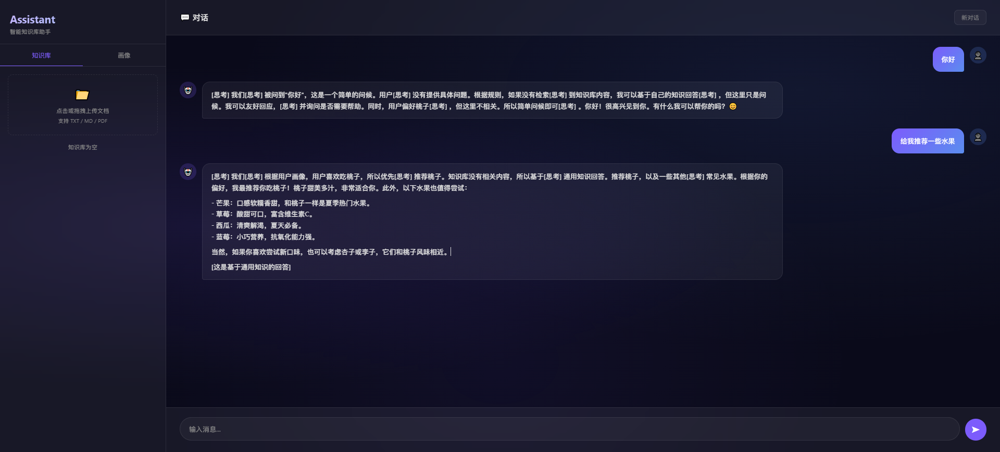
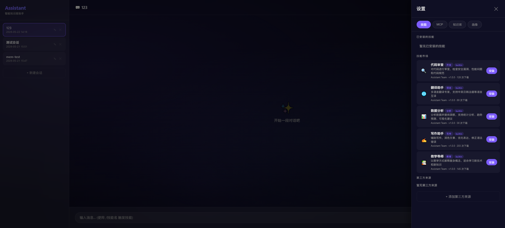

# Assistant — 智能知识库助手

基于 NVIDIA API（OpenAI 兼容）构建的 RAG 智能助手，集成 PostgreSQL + pgvector 向量检索、长期记忆、用户画像、MCP 工具协议、技能市场与 Function Calling 工具系统。

---

## 目录

1. [功能概览](#1-功能概览)
2. [架构总览](#2-架构总览)
3. [项目结构](#3-项目结构)
4. [模块详解](#4-模块详解)
   - [4.1 配置管理](#41-配置管理-configpy)
   - [4.2 LLM 客户端](#42-llm-客户端-llm)
   - [4.3 工具系统](#43-工具系统-agenttoolpy)
   - [4.4 向量存储](#44-向量存储-vector_store)
   - [4.5 知识库引擎](#45-知识库引擎-knowledge)
   - [4.6 记忆系统](#46-记忆系统-memory)
   - [4.7 Agent 核心](#47-agent-核心-agent)
   - [4.8 技能系统](#48-技能系统-skill)
   - [4.9 MCP 工具协议](#49-mcp-工具协议-mcp)
   - [4.10 会话管理](#410-会话管理-session)
   - [4.11 CLI 界面](#411-cli-界面-cli)
   - [4.12 API 服务](#412-api-服务-api)
   - [4.13 Web 界面](#413-web-界面)
   - [4.14 第三方市场源](#414-第三方市场源)
5. [数据库设计](#5-数据库设计)
6. [API 接口参考](#6-api-接口参考)
7. [启动指南](#7-启动指南)
8. [命令参考](#8-命令参考)
9. [技术栈](#9-技术栈)

---

## 1. 功能概览

| 功能 | 说明 |
|------|------|
| RAG 对话 | 基于知识库的检索增强生成，自动引用来源 |
| 工具调用 | ReAct 循环 + Function Calling，内置天气查询等工具 |
| MCP 协议 | 接入第三方 MCP Server，动态加载外部工具 |
| 技能系统 | 可安装/可触发的技能模块，支持自动触发与关键词激活 |
| 长期记忆 | 自动从对话中提取重要信息，跨会话回忆 |
| 用户画像 | 自动识别并更新用户偏好与背景信息 |
| 知识库管理 | 支持 TXT/MD/PDF 文档导入、分块、向量化检索 |
| 会话管理 | 多会话支持，会话间隔离 |
| 市场系统 | 内置技能/MCP 市场，支持添加第三方市场源 URL |
| 双界面 | CLI 终端 + Web 聊天界面（FastAPI + SSE 流式） |

---



---

## 2. 架构总览

```
┌──────────────────────────────────────────────────────┐
│                    交互层                             │
│   CLI (rich)          Web UI (SSE 流式)              │
│   cli/app.py          api/index.html                 │
└──────────────────────┬───────────────────────────────┘
                       │
┌──────────────────────▼───────────────────────────────┐
│                  API 网关层                           │
│   FastAPI (api/server.py)                            │
│   /api/chat  /api/kb/*  /api/skill/*  /api/mcp/*    │
└──────────────────────┬───────────────────────────────┘
                       │
┌──────────────────────▼───────────────────────────────┐
│                  Agent 核心层                          │
│   agent/core.py  —  ReAct 循环 (最多5轮)             │
│   agent/tool.py  —  工具注册表 + Function Calling     │
│   agent/prompts.py                                    │
│   ┌──────────┐  ┌──────────┐  ┌──────────────────┐   │
│   │ 技能注入  │  │ 工具编排  │  │  上下文组装      │   │
│   │ skill/   │  │ MCP/内置  │  │  画像+记忆+知识库 │   │
│   └──────────┘  └──────────┘  └──────────────────┘   │
└──────────────────────┬───────────────────────────────┘
                       │
┌──────────────────────▼───────────────────────────────┐
│                    领域服务层                          │
│  knowledge/      memory/         skill/    mcp/      │
│  - ingestion     - short_term    - registry - client │
│  - retrieval     - long_term     - loader   - manager│
│  - manager       - profile       - market   - market │
└──────────────────────┬───────────────────────────────┘
                       │
┌──────────────────────▼───────────────────────────────┐
│                    基础设施层                          │
│  PostgreSQL + pgvector    NVIDIA API                  │
│  (向量存储+业务数据)       (Chat + Embedding)          │
└──────────────────────────────────────────────────────┘
```

---

## 3. 项目结构

```
Assistant/
├── main.py                          # CLI 启动入口
├── .env                             # 环境变量
├── .env.example                     # 环境变量模板
├── pyproject.toml                   # 项目依赖
├── README.md
│
├── data/
│   ├── skill_market.json            # 技能市场（内置）
│   ├── skill_state.json             # 技能状态持久化
│   └── mcp_market.json              # MCP 市场（内置）
│
└── src/
    ├── config.py                    # 配置管理
    ├── market_sources.py            # 第三方市场源管理
    │
    ├── llm/                         # LLM 调用层
    │   ├── client.py                # NVIDIA API 客户端 (Chat + Embedding + Tool Calling)
    │   └── models.py                # 模型常量 + 维度映射
    │
    ├── vector_store/                # 向量存储
    │   ├── db.py                    # PG 连接、建表、迁移
    │   └── chunker.py               # 文档智能分块
    │
    ├── knowledge/                   # 知识库引擎
    │   ├── ingestion.py             # 文档读取、分块、向量化写入
    │   ├── retrieval.py             # 语义检索（余弦相似度）
    │   └── manager.py               # 文档列表、删除
    │
    ├── memory/                      # 记忆系统
    │   ├── short_term.py            # 短期对话记忆 (deque 滑动窗口)
    │   ├── long_term.py             # 长期向量记忆（LLM 自动提取）
    │   └── profile.py               # 用户画像（键值对 + LLM 自动更新）
    │
    ├── agent/                       # Agent 核心
    │   ├── core.py                  # ReAct 主循环 + 技能触发检测
    │   ├── tool.py                  # ToolRegistry + Function Calling Schema
    │   ├── prompts.py               # 系统提示模板
    │   └── tools/                   # 内置工具
    │       ├── __init__.py
    │       └── weather.py           # 天气查询工具 (wttr.in)
    │
    ├── skill/                       # 技能系统
    │   ├── registry.py              # SkillRegistry（注册、启用、触发）
    │   ├── loader.py                # 技能文件扫描加载
    │   ├── market.py                # 技能市场（本地 + 第三方合并）
    │   └── skills/                  # 内置技能定义
    │       ├── code_review.py       # 代码审查技能
    │       └── translator.py        # 翻译助手技能
    │
    ├── mcp/                         # MCP 工具协议
    │   ├── client.py                # MCPClientManager (stdio/http/sse)
    │   ├── manager.py               # MCP 服务器 CRUD (PG 持久化)
    │   └── market.py                # MCP 市场（本地 + 第三方合并）
    │
    ├── session/                     # 会话管理
    │   └── manager.py               # 会话 CRUD (PG 持久化)
    │
    ├── api/                         # API + Web 界面
    │   ├── server.py                # FastAPI 应用 (30+ 端点)
    │   └── index.html               # 单页 Web 聊天界面
    │
    └── cli/                         # CLI 界面
        ├── app.py                   # CLI 入口 + MCP 自动连接
        └── commands.py              # / 命令处理系统
```

---

## 4. 模块详解

### 4.1 配置管理 (`config.py`)

基于 `pydantic-settings`，自动从 `.env` 加载。

| 配置项 | 默认值 | 说明 |
|--------|--------|------|
| `nvidia_api_key` | - | NVIDIA API 密钥 |
| `nvidia_base_url` | `integrate.api.nvidia.com/v1` | API 地址 |
| `llm_chat_model` | `deepseek-ai/deepseek-v4-flash` | 对话模型 |
| `llm_embedding_model` | `nvidia/nv-embedqa-e5-v5` | Embedding 模型 |
| `pg_host` | `172.16.3.20` | PostgreSQL 主机 |
| `pg_port` | `5432` | PostgreSQL 端口 |
| `pg_database` | `assistant` | 数据库名 |
| `agent_top_k_chunks` | `5` | 知识库检索数量 |
| `agent_top_k_memories` | `3` | 记忆检索数量 |
| `agent_chunk_size` | `500` | 文档分块大小 |
| `agent_chunk_overlap` | `50` | 分块重叠字数 |

### 4.2 LLM 客户端 (`llm/`)

全局单例 `llm_client`，封装 NVIDIA API。

| 方法 | 说明 |
|------|------|
| `embed(texts)` | 生成查询 embedding（`input_type=query`） |
| `embed_documents(texts)` | 生成文档 embedding（`input_type=passage`） |
| `chat_stream(messages)` | 流式对话，支持 reasoning（思维链）输出 |
| `chat(messages)` | 非流式对话 |
| `chat_with_tools(messages, tools)` | Function Calling，返回 `(content, tool_calls)` |

支持的模型通过 `llm/models.py` 管理，含 6 个对话模型和 3 个 embedding 模型。

### 4.3 工具系统 (`agent/tool.py`)

**ToolRegistry** — 全局工具注册表，统一管理内置工具和 MCP 工具。

```
ToolRegistry
├── register(tool)          # 注册工具
├── unregister_by_source()  # 按来源移除（断开 MCP 时清理）
├── get_all_for_llm()       # 生成 OpenAI Function Calling Schema
├── execute(name, args)     # 执行工具
└── list_all()              # UI 展示用
```

**内置工具** (`agent/tools/weather.py`)：
- `get_weather` — 通过 wttr.in 免费 API 查询城市天气

通过 `@register_tool` 装饰器注册，只需定义 name、description、parameters 即可。

### 4.4 向量存储 (`vector_store/`)

- **db.py**: 异步 psycopg 连接、建表、ivfflat 索引、自动迁移
- **chunker.py**: 段落优先 + 句子兜底的分块策略，保留来源 metadata

### 4.5 知识库引擎 (`knowledge/`)

**摄入流水线**: `文件读取 → 文本提取 → 智能分块 → 批量 Embedding → 写入 pgvector`

支持格式：`.txt`、`.md`、`.pdf`

| 函数 | 说明 |
|------|------|
| `ingest_file(path)` | 摄入单个文件 |
| `ingest_directory(path)` | 递归摄入目录 |
| `search_chunks(query, top_k)` | 语义检索 |
| `list_documents()` | 文档列表（含分块数） |
| `delete_document(id)` | 级联删除 |

### 4.6 记忆系统 (`memory/`)

| 模块 | 实现 | 说明 |
|------|------|------|
| `short_term.py` | `deque` 滑动窗口 | 对话上下文，默认保留 20 轮 |
| `long_term.py` | pgvector 向量存储 | LLM 自动从对话提取重要信息 |
| `profile.py` | 键值对存储 | LLM 自动识别用户偏好并更新 |

记忆类型：`fact`（事实）、`preference`（偏好）、`conversation`（对话）

### 4.7 Agent 核心 (`agent/`)

**ReAct 主循环** (最多 5 轮工具调用)：

```
用户输入 → 技能触发检测 → 并行检索(知识库+记忆+画像)
→ 组装系统提示 → ReAct 循环(LLM↔工具) → 流式输出
→ 后处理(提取记忆+更新画像)
```

**技能触发机制**：
- `auto_trigger=True` — 技能 prompt 始终注入
- `auto_trigger=False` — 仅当消息含触发关键词时才注入
- 支持 `/技能名` 命令触发（自动清理前缀后传递给 LLM）

### 4.8 技能系统 (`skill/`)

**Skill 数据模型**：

| 字段 | 说明 |
|------|------|
| `name` | 唯一标识 |
| `display_name` | 显示名称 |
| `description` | 描述 |
| `prompt_append` | 注入到 system prompt 的内容 |
| `trigger_keywords` | 触发关键词列表（如 `/code-review`, `审查代码`） |
| `auto_trigger` | 是否自动触发（开关） |
| `enabled` | 是否启用 |

**内置技能**：

| 技能 | 触发词 |
|------|--------|
| 代码审查 (`code-review`) | `/code-review`, `/review`, `审查代码` |
| 翻译助手 (`translator`) | `/translator`, `/translate`, `翻译` |

**技能市场**：内置 5 个技能（代码审查、翻译、数据分析、写作助手、教学导师），支持从市场安装，安装后立即生效。

### 4.9 MCP 工具协议 (`mcp/`)

实现 MCP (Model Context Protocol) 客户端，支持三种传输方式：

| 传输方式 | 适用场景 |
|----------|----------|
| `stdio` | 本地子进程（如 npx server） |
| `http` | 远程 HTTP 服务 |
| `sse` | Server-Sent Events |

**核心机制**：
- `AsyncExitStack` 管理传输和会话生命周期，确保资源正确清理
- 发现 MCP Server 的工具后，以 `mcp__{server_name}__{tool_name}` 格式注册到 `ToolRegistry`
- `auto_connect=True` — 启动时自动连接；`auto_connect=False` — 手动连接

**内置 MCP 市场**：filesystem、github、brave-search、sqlite、postgres

### 4.10 会话管理 (`session/`)

PostgreSQL 持久化的会话系统，支持多会话隔离（不同会话有独立的短期记忆，共享长期记忆和画像）。

### 4.11 CLI 界面 (`cli/`)

启动时自动连接 MCP（`connect_auto`），支持 `/` 命令系统：

| 命令 | 说明 |
|------|------|
| `/kb add/list/search/delete` | 知识库管理 |
| `/memory search` | 记忆搜索 |
| `/profile show/set/del` | 画像管理 |
| `/session new/list/switch/rename/del` | 会话管理 |
| `/clear` | 清除短期记忆 |
| `/help` | 帮助 |
| `/exit` | 退出 |

### 4.12 API 服务 (`api/`)

FastAPI 应用，提供 35+ REST 端点，核心能力：

- **对话**: SSE 流式响应，支持 `triggered_skills` 参数
- **知识库**: 文件上传 / 列表 / 搜索 / 删除
- **会话**: 创建 / 列表 / 切换 / 重命名 / 删除
- **技能**: 列表 / 启用禁用 / 自动触发开关 / 市场安装 / 第三方源管理
- **MCP**: 服务器 CRUD / 自动连接开关 / 重连 / 工具查看 / 市场 / 第三方源管理
- **画像**: 键值对 CRUD

### 4.13 Web 界面 (`api/index.html`)



纯 vanilla JS 单页应用，深色主题：

- **左侧**: 会话列表（新建、切换、重命名、删除）
- **中央**: 流式聊天（SSE），支持 Markdown 渲染
- **Header**: ⚙ 设置按钮，右侧滑入设置面板
- **设置面板**: 技能 / MCP / 知识库 / 画像 四个子板块
- **触发栏**: 输入框上方显示已激活的技能标签
- **自动触发/自动连接**: 每个技能和 MCP 服务器都有独立的 toggle 开关

### 4.14 第三方市场源 (`market_sources.py`)

支持添加外部 URL 作为技能/MCP 市场的补充来源。外部 URL 需返回与本地市场相同格式的 JSON 数组。

| 接口 | 说明 |
|------|------|
| `GET /api/{skill\|mcp}/market/sources` | 列出第三方源 |
| `POST /api/{skill\|mcp}/market/sources` | 添加源 `{name, url}` |
| `DELETE /api/{skill\|mcp}/market/sources/{id}` | 删除源 |
| `PUT /api/{skill\|mcp}/market/sources/{id}` | 开关源 |

合并策略：本地数据优先，第三方条目按 name 去重。

---

## 5. 数据库设计

### 表一览

| 表 | 说明 |
|----|------|
| `documents` | 文档元数据 |
| `chunks` | 文档分块 + embedding 向量（ivfflat 索引） |
| `sessions` | 会话记录 |
| `memories` | 长期记忆 + embedding 向量（ivfflat 索引） |
| `user_profile` | 用户画像键值对 |
| `mcp_servers` | MCP 服务器配置 |
| `market_sources` | 第三方市场源 URL |

### 关键关联

```
documents 1 ──< N chunks (CASCADE DELETE)
sessions  1 ──< N memories (SET NULL on delete)
```

### 向量索引

```sql
CREATE INDEX ON chunks USING ivfflat (embedding vector_cosine_ops) WITH (lists = 100);
CREATE INDEX ON memories USING ivfflat (embedding vector_cosine_ops) WITH (lists = 100);
```

---

## 6. API 接口参考

### 对话

| 方法 | 路径 | 说明 |
|------|------|------|
| `POST` | `/api/chat` | SSE 流式对话，body: `{message, session_id?, triggered_skills?}` |

### 知识库

| 方法 | 路径 | 说明 |
|------|------|------|
| `POST` | `/api/kb/upload` | 上传文档（multipart） |
| `GET` | `/api/kb/list` | 文档列表 |
| `DELETE` | `/api/kb/{doc_id}` | 删除文档 |

### 会话

| 方法 | 路径 | 说明 |
|------|------|------|
| `POST` | `/api/session/new?title=` | 创建会话 |
| `GET` | `/api/session/list` | 会话列表 |
| `DELETE` | `/api/session/{id}` | 删除会话 |
| `PUT` | `/api/session/{id}/rename?title=` | 重命名 |

### 技能

| 方法 | 路径 | 说明 |
|------|------|------|
| `GET` | `/api/skill/list` | 已安装技能列表 |
| `PUT` | `/api/skill/{name}/auto-trigger` | 开关自动触发 |
| `POST` | `/api/skill/{name}/trigger` | 手动触发 |
| `POST` | `/api/skill/{name}/enable` | 启用 |
| `POST` | `/api/skill/{name}/disable` | 禁用 |
| `DELETE` | `/api/skill/{name}` | 删除 |
| `GET` | `/api/skill/market` | 技能市场（含第三方） |
| `POST` | `/api/skill/market/{name}/install` | 从市场安装 |

### MCP

| 方法 | 路径 | 说明 |
|------|------|------|
| `GET` | `/api/mcp/servers` | 服务器列表（含状态） |
| `POST` | `/api/mcp/servers` | 添加服务器 |
| `DELETE` | `/api/mcp/servers/{id}` | 删除服务器 |
| `PUT` | `/api/mcp/servers/{id}/auto-connect` | 开关自动连接 |
| `POST` | `/api/mcp/servers/{id}/reconnect` | 重新连接 |
| `GET` | `/api/mcp/servers/{id}/tools` | 查看工具列表 |
| `GET` | `/api/mcp/market` | MCP 市场（含第三方） |
| `POST` | `/api/mcp/market/{name}/add` | 从市场添加 |

### 画像

| 方法 | 路径 | 说明 |
|------|------|------|
| `GET` | `/api/profile` | 获取画像 |
| `POST` | `/api/profile` | 设置 `{key, value}` |
| `DELETE` | `/api/profile/{key}` | 删除条目 |

### 第三方市场源

| 方法 | 路径 | 说明 |
|------|------|------|
| `GET` | `/api/{skill\|mcp}/market/sources` | 列表 |
| `POST` | `/api/{skill\|mcp}/market/sources` | 添加 `{name, url}` |
| `DELETE` | `/api/{skill\|mcp}/market/sources/{id}` | 删除 |
| `PUT` | `/api/{skill\|mcp}/market/sources/{id}` | 开关 |

---

## 7. 启动指南

### 前置条件

- Python 3.13+
- PostgreSQL 17+ 已安装 pgvector 扩展
- NVIDIA API Key（从 [build.nvidia.com](https://build.nvidia.com) 获取）

### 快速启动

```bash
# 1. 安装依赖
uv sync

# 2. 配置环境变量
cp .env.example .env
# 编辑 .env 填入 NVIDIA_API_KEY 和 PostgreSQL 连接信息

# 3. 安装 pgvector 扩展（在 PostgreSQL 中执行，需超级用户）
# CREATE EXTENSION IF NOT EXISTS vector;

# 4. CLI 模式
python main.py

# 5. Web 模式
uvicorn src.api.server:app --reload
# 打开 http://localhost:8000
```

### 环境变量示例 (`.env`)

```env
NVIDIA_API_KEY=nvapi-xxxxxxxxxxxxxxxx
NVIDIA_BASE_URL=https://integrate.api.nvidia.com/v1
LLM_CHAT_MODEL=deepseek-ai/deepseek-v4-flash
LLM_EMBEDDING_MODEL=nvidia/nv-embedqa-e5-v5
PG_HOST=172.16.3.20
PG_PORT=5432
PG_DATABASE=assistant
PG_USER=assistant
PG_PASSWORD=your_password
```

---

## 8. 命令参考

### CLI 命令

| 命令 | 示例 | 说明 |
|------|------|------|
| `/kb add <path>` | `/kb add ./docs/` | 导入文档/目录 |
| `/kb list` | `/kb list` | 文档列表 |
| `/kb search <q>` | `/kb search 认证方式` | 搜索知识库 |
| `/kb delete <id>` | `/kb delete 3` | 删除文档 |
| `/memory search <q>` | `/memory search 偏好` | 搜索记忆 |
| `/profile show` | `/profile show` | 查看画像 |
| `/profile set <k> <v>` | `/profile set 职业 工程师` | 设置画像 |
| `/profile del <k>` | `/profile del 职业` | 删除画像 |
| `/session new <title>` | `/session new 工作会话` | 新建会话 |
| `/session list` | `/session list` | 会话列表 |
| `/session switch <id>` | `/session switch 2` | 切换会话 |
| `/session rename <id> <t>` | `/session rename 2 项目A` | 重命名 |
| `/session del <id>` | `/session del 2` | 删除会话 |
| `/clear` | `/clear` | 清除短期记忆 |
| `/help` | `/help` | 帮助 |
| `/exit` | `/exit` | 退出 |

### 聊天中触发技能

在 Web 界面或 CLI 中，输入含技能触发关键词的消息即可激活技能：

```
/code-review 请审查这段代码
/translate Hello World
```

也可在 Web 界面点击"触发"按钮预激活技能，下次发送消息时自动携带。

---

## 9. 技术栈

| 层次 | 技术 | 用途 |
|------|------|------|
| 运行时 | Python 3.13+ | 异步原生支持 |
| LLM 网关 | NVIDIA API | OpenAI 兼容接口 |
| 对话模型 | DeepSeek V4 Flash/Pro | 主力推理 |
| Embedding | NV-EmbedQA-E5-V5 | 1024 维向量 |
| 向量库 | PostgreSQL + pgvector | 向量存储与检索 |
| DB 驱动 | psycopg 3.x (binary) | 异步连接 |
| Web 框架 | FastAPI + Uvicorn | API 服务 |
| 配置 | pydantic-settings | 类型安全配置 |
| CLI | Rich | 终端美化 |
| MCP | mcp >= 1.27.1 | 工具协议客户端 |
| HTTP 客户端 | httpx | 异步 HTTP（第三方市场源） |
| PDF | pypdf | PDF 解析 |
| Markdown | markdown-it-py | MD 解析 |
| 包管理 | uv | 快速依赖管理 |
